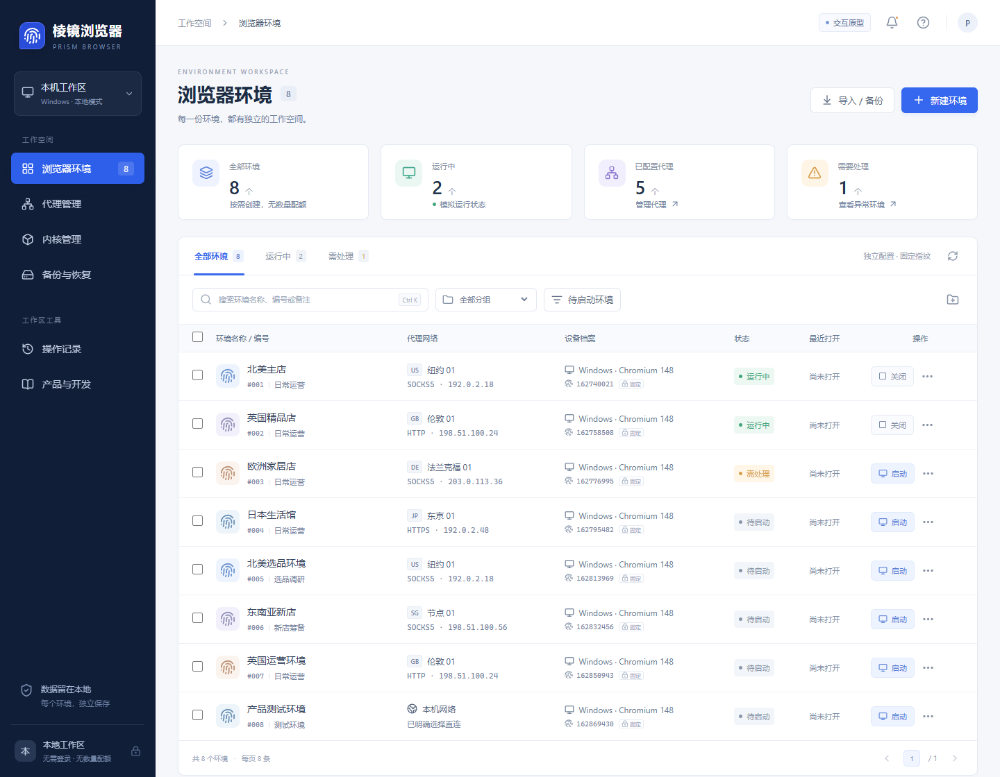
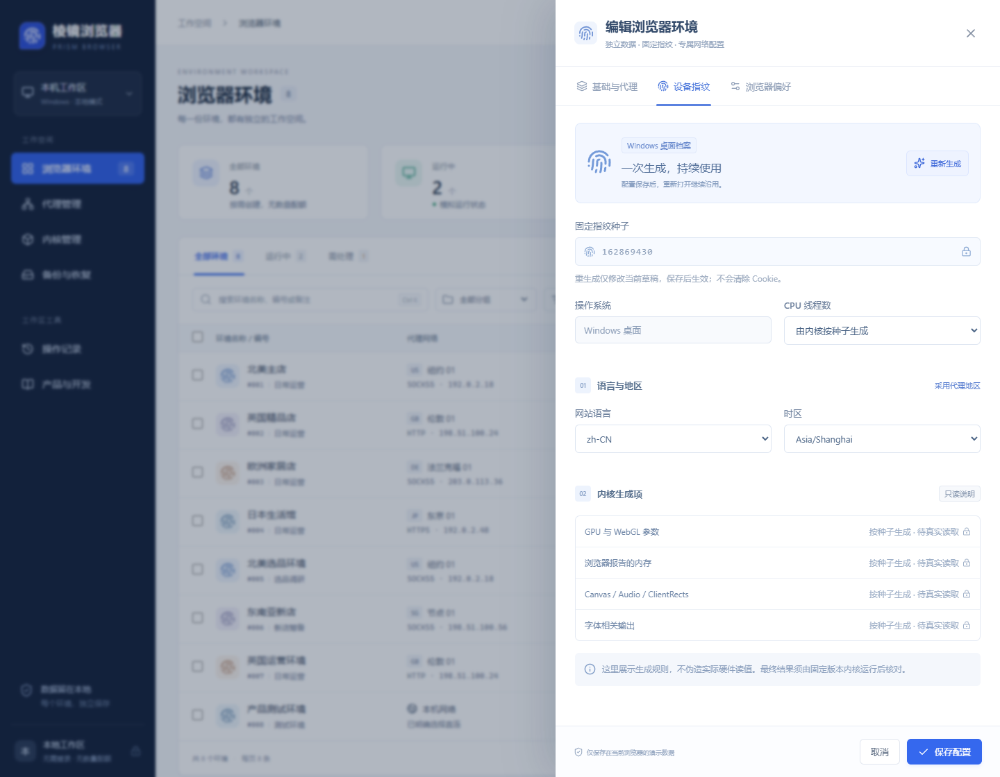
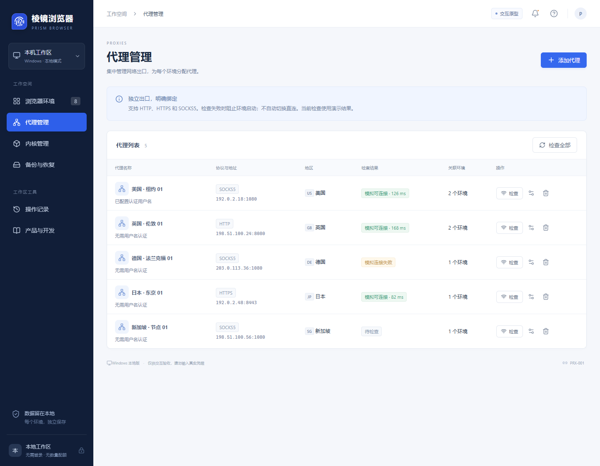
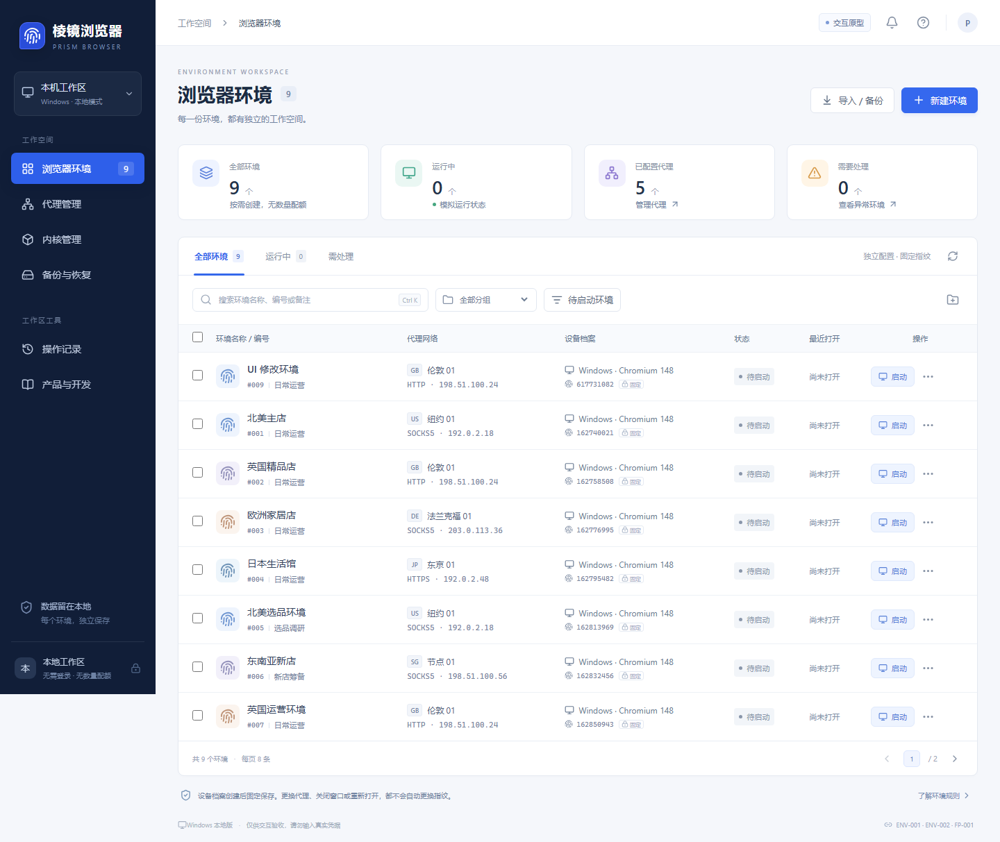
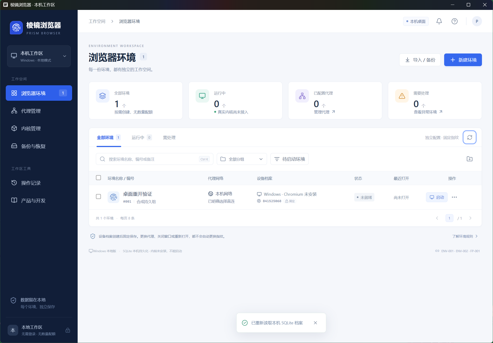
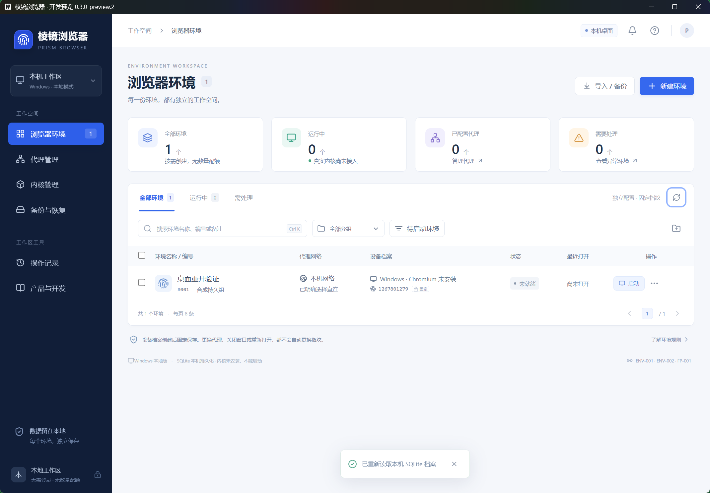
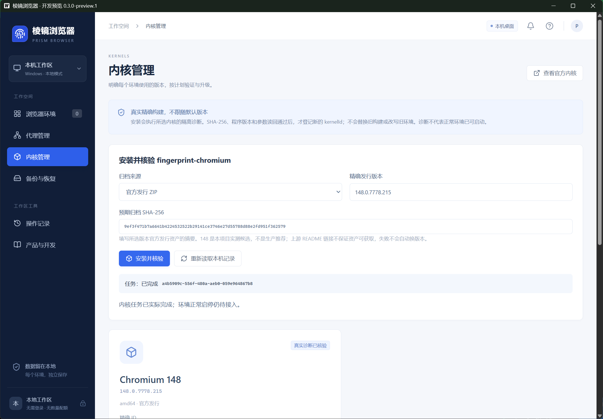
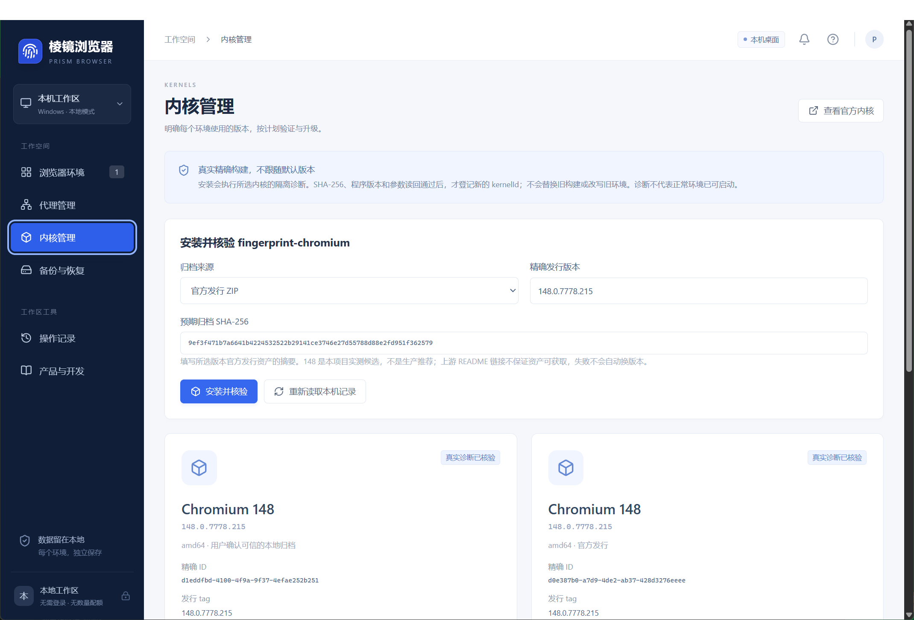

[项目首页](../README.md) · [产品需求](PRD.md) · [需求追踪](TRACEABILITY.md)

# 当前交付验收记录

## #33 唯一参考 shell / 环境表（2026-10-06；本地交付，待集成终验）

「完整代码」冻结标识 `202609160208` 为本轮唯一视觉基准；[40 状态/来源限制/能力映射](UI_REFERENCE.md) 和 [公共 UI 责任/props](UI_CONTRACT.md) 已登记。#33 替换旧 shell/统计卡/工具栏，提供真实服务环境表、10条分页/独立滚动、精确选择、筛选和派生分组，保留既有安全/低频入口。

最终定向点击 **14/14，27.5秒**（新增7 + 既有受影响7），类型通过。初始几何 RED、中间 fixture 失败及修复记录保留；没有按票运行全套。**34张两视口合成 PNG + 2张滚动图，page error 0**；已对照实际图，环境表和500px分组容器主要几何一致，裁剪/安全适配与1px级偏差逐项说明。结果与图见 [#33 验证记录](verification/issue33.md)。公共样式不等于其余页全部1:1，#34–#37仍须分别交付/终验。

由 merger 合入 `9e256a7`，增量草稿 [PR #38](https://github.com/axgiroud312-byte/prism-local-browser/pull/38) 基于 PR #31 的 `codex/issue28-30-delivery`；没有自动合并旧 PR，也没有关闭本轮票。#34–#36 从同一集成提交进入独立 worktree；公共入口/样式/控件仍由集成负责人唯一修改。

集成公共保护补测：新增原生坏桥/加载中阻断层键盘用例，初始 **0/2** 确認焦点落在背景；修复最高阻断层、无可用按钮时容器焦点、Tab/Shift+Tab/Ctrl+K/Escape 边界和背景控件禁用。随后与原有取消编辑/代理返回/跨标签页冲突定向合跑 **5/5，5.6秒**。类型检查通过。没有运行整组全套；这些操作证据不替代逐页视觉终验。

未生产构建/打包、编译桌面、运行Go/Wails/安装/UIA/真实内核网络目录验证；不覆盖下方 #29/#30 历史21/21或旧候选，不改变正式 **4/21、#6–#22 OPEN**。

## #28–#30 统一流程页面验收（2026-10-06；本地通过，待合并）

[#30](https://github.com/axgiroud312-byte/prism-local-browser/issues/30) 实现环境表和统一创建/编辑窗口，[#29](https://github.com/axgiroud312-byte/prism-local-browser/issues/29) 六项整体流程分别核对；[#28](https://github.com/axgiroud312-byte/prism-local-browser/issues/28) 直接复用 `53ac883` 的单任务轻量检查，不重造 CI。实现 `9e5b819`、审查修复 `d039147` 集成到 `e1573ca`，普通编辑/重开保持 seed，创建确认后按原 ID 打开，失败不再创建、不回退直连。

`npm run check` **21/21，45.2 秒**：14 条 demo、7 条合成 bridge。覆盖创建/编辑保存/取消/重载、分组搜索、服务内核及网络选择、换一套和稳定保存、单个及混合批量启停、创建后异步打开失败重试不重复创建、坏桥阻断、代理导入取消/失败/成功草稿及焦点恢复、存储失败逐项反馈、大批次取消、390px 窄窗口和低频 Cookie/备份入口。#29/#30 共用该整轮结果，不逐票重跑。首次基线 RED、整轮失败及修复后的定向结果如实见 [逐票矩阵](verification/issue28-30.md)，不是一路成功的声明。

独立代码审查发现 2 个 P2，无 P1；与联调揭示的菜单遮挡一起修复并回归通过。非法数量不提交且草稿可恢复；真正未知提交继续保留原请求/幂等保护。demo 持久化失败明确失败/未执行，保留已成功项和原记录，完成写失败后恢复存储可重试。`npm run typecheck` 通过；`npm run check:docs` **52 文档/链接、12 需求、6 路由、4 内嵌文档通过**，首轮遗漏 `activity` 的失败修复保留，检查脚本未改。最新远程单 job/head/时间与待合并交付回填对应 PR/issue。

[PR #31](https://github.com/axgiroud312-byte/prism-local-browser/pull/31) 向现有集成分支增量交付，待合并；PR #27 保持草稿及历史未验说明。[远程 CI 37424312735](https://github.com/axgiroud312-byte/prism-local-browser/actions/runs/37424312735) 对交付 head `935cf5f` **21/21，57.2 秒**，仅一个 Browser clicks job、1 分 38 秒，步骤未包含构建或桌面测试。回执文档不改变源码/测试；最终最新 head/run 另核对并登记 PR/三票，不能把旧 head 结果冒称最终提交。

已生成并核对：[环境表](screenshots/issue30-environments.png)、[新建窗口](screenshots/issue30-create.png)、[窄窗口](screenshots/issue30-narrow.png)，Vite 当前源码合成 demo 数据、页面错误 0。不是旧候选 exe、真实内核、SQLite 或流量证据。注入 bridge fixture 的 sessionStorage 仅证明模拟重载。未执行生产构建/打包、Go/Wails 全套、安装卸载、Windows UIA、真实内核/进程/网络验证；旧候选身份和下方历史事实不改写，正式 **4/21、T05–T21 / #6–#22 OPEN** 保持不变。

## 日常 CI 精简为浏览器点击（2026-10-06）

[#28](https://github.com/axgiroud312-byte/prism-local-browser/issues/28)：默认 CI 从两版本前端检查和桌面安装任务缩为一个 Node.js 24 / Windows 的浏览器任务。仅安装 npm 依赖、Playwright Chromium headless shell 并运行 `test:ui`；Playwright 启动/关闭 Vite，失败附件保留 7 天。`npm run check` 同步为页面测试，不执行生产构建、Go/Wails、安装包或产品内核探测。

本地首次因缺少 Playwright 对应浏览器而无法启动，补齐测试浏览器后，`npm run check` **13/13 通过（41.8 秒）**。现有创建/编辑/重载、取消、校验、失败重试、跨标签页、窄窗口及模拟 bridge 交互断言均保留。报告在 `output/playwright/report/`；远程执行结果回写 #28，不能由本地通过推定远程通过。本轮没有运行完整后台测试或构建。

#28 远程实际结果已核对：[37419040709](https://github.com/axgiroud312-byte/prism-local-browser/actions/runs/37419040709)，保留的 `53ac883` 提交只有 Browser clicks 一个 job，1 分 27 秒完成，13/13 浏览器用例通过（34.1 秒）。没有生产构建/Go/Wails/安装或产品内核探测；成功 run 的失败附件上传按条件跳过，仅配置存在，不冒称实际上传已验。该旧结果不能作为 #29/#30 新用例通过的证据。

该次 #28 检查只覆盖 demo 和模拟 bridge，不增加原生能力验收计数。当时已移除旧六页布局约束、禁止浏览器点击及自动续跑旧路线，#29 仅建票、界面尚未修改；后续 #29/#30 的新结果见本页上方，不倒改原记录。下方继续保留原候选交付的历史结果。

## 本机缺口补验与批次失败修复（2026-10-06）

[统一12项结果](verification/V1-local-acceptance.md)及[源码/脱敏观测回执](verification/V1-local-acceptance.json)：实际普通停止超时→ForceStop、Cookie分区/过期/冲突/清空/取消、257个真实空目录、12项真实队列、两运行环境正常停/完整包/三存储恢复、真实ACL与SQLite容量回滚、永久删除权限恢复均通过。131项前端后台、Go全包342顶层PASS/30 opt-in/helper SKIP及vet exit0；11个新opt-in另行实跑通过，不把SKIP算通过。

实际目录拒绝揭示生产typed-nil清理崩溃，wrapper转换前规范化nil，无seamACL回归/保身份续跑通过，原FAIL保留。没有削弱保护、删测试、提权、停服、填满系统盘、修改真实数据或自动点击。新干净67c98db来源`.5/.6`构建/本机无点击安装、升级/拒降级/保留卸载/重装通过，6工作台exit0及五产品位置清理已独立核对；trimpath/两exe路径扫描、9文件/全许可/SHA与同源源码ZIP齐全。[当前回执](verification/V1-candidate-acceptance.json)、[旧`.4`历史回执](verification/V1-candidate.4-acceptance.json)。默认CI新增一次性Windows的无点击产品安装，远程实际结果另记；不启用旧点击分支、不混用development-preview和candidate哈希。独立远端、人工、精确交付包干净Windows/缺WebView2、跨登录/重启、真正NTFS/OS资源故障仍待验，**正式4/21、#6–#22 OPEN不变**。下列“不改业务/无需重建”仅对应当时CI观测修订，不适用于本次生产修复。

## 远程同步接续（2026-10-06；不增加完整验收计数）

新增无点击runner安装首轮[37407497714](https://github.com/axgiroud312-byte/prism-local-browser/actions/runs/37407497714)在执行安装之前被脏源码门禁挡住；两Node/Go/build通过，但本轮整体FAIL，内核后续探测未执行。全新检出复现Wails/go mod tidy使go.mod由CRLF变LF，只有该文件状态变脏、规范化diff为空、依赖SHA不变；用户批准继续仅修CI/构建管理，`.gitattributes`只固定go.mod/go.sum为LF。未忽略状态/移除tidy/放宽源码或安全核对，修订后的真实复验另记；本机candidate.6不受影响。[本轮远程回执](verification/V1-local-remote.json)保留首轮失败。

**修订复验已通过：**[37409611901](https://github.com/axgiroud312-byte/prism-local-browser/actions/runs/37409611901)，eec3333三个job SUCCESS；全新检出两次production构建干净/两manifest sourceDirty=false，实际改动go.mod仍被原脚本在安装前拒绝，[门禁实测](verification/V1-ci-source-guard.json)。一次性Server 2025已有WebView2，development-preview.1/.2实际default known folders安装/重开/升级保身份/拒降级25/保留卸载/重装/仅删自有合成根通过；6只读native页面和正常exit0、5次必须合成记录读取满足，下载[原脱敏安装回执](verification/V1-ci-installation.json)及两个安装包SHA已核对。PR head和merge checkout分别记录，四点击分支SKIP；Node22/24各131/类型/build/51文档、Go全包/vet、真实148诊断23.67秒/档案读回41.12秒通过。新LF go.sum的物理SHA不同但规范化依赖逐字相同，旧哈希保留。不是精确candidate.6在Home新用户/VM/缺WebView2或人工验收，freshWindowsUser=false不改写；正式4/21不变。

用户恢复登录后已核对GitHub身份；38个本地提交普通推送成功，创建[草稿PR #27](https://github.com/axgiroud312-byte/prism-local-browser/pull/27)，17票实测/缺口评论均已发布，全部仍OPEN。[首轮默认无点击CI](https://github.com/axgiroud312-byte/prism-local-browser/actions/runs/37400229514)两Node检查通过，desktop原SDDL全字符串断言失败；当时未先认定误报，后续实际权限核对见下段。首轮安装构建及真实内核步骤未执行，无artifact上传失败为前序未产包的结果，不把首轮改记成功。[同步回执](verification/V1-remote-sync.json)记录URL/commit/范围。GitHub认证和修订CI阻塞已解除；独立外部、特殊真实场景、人工、干净Windows仍缺，正式4/21不变。

用户已明确确认CI修复范围；仅修改测试查询/断言，不改生产ACL/provider。显式请求owner/group/DACL并比较实际SID、每条ACE字节/顺序和DACL继承保护；新增12个语义子例确保权限扩大/deny/身份/继承/顺序改变被拒，部分/NULL DACL也拒。实际目录回收与占用安全回归未删或跳过，本机4个顶层用例/12子例及kernel vet通过；远程复验另记，不重建未改的候选业务二进制。

**修订远程CI已通过：**[37401271261](https://github.com/axgiroud312-byte/prism-local-browser/actions/runs/37401271261)对应6cf1768，三个job全绿。Node22.12.0/24各131项后台/类型/build/文档通过，Go全包/vet及Windows preview.1/.2构建成功，真实148内核探测14.82秒、保存/重生成/回滚22.31秒正常退出。Windows CI的实际owner/group、完整ACE与DACL保护不变核对通过，确认修订没有放行实质权限变化；只读评审亦无可信P1/P2。自动点击和产品安装步骤都没执行，**不当作干净Windows产品安装或人工业务验收**。首轮FAIL仍保留，正式4/21不变；候选.4及其4b38dc8来源不变。

## 首版集中验收与候选交付（2026-10-05）

[本轮报告](verification/V1-final.md)逐票列出T05–T21实现、命令、实际结果、证据与关闭条件。129项前端后台/6项修订、Go内部包/根包补编/vet通过；本轮实际空目录批次、DPAPI与精确build映射候选、固定档案真实保存/重生成/回滚、恢复占用/回滚再中断、回收10及迁移4个Kill切点通过。原Go整轮dist竞态FAIL和首轮测试RPC错误保留，不伪造完整check/UI/远程成功。

历史干净`4b38dc8`源码/trimpath候选`.3/.4`构建和本机无点击实际NSIS闭环通过：6次native页面读取/正常exit0、升级保身份、拒降级25、默认保留卸载/重装及仅删自有合成根；最终五个产品位置均不存在。旧`.4`SHA和版本/签名/依赖见[总报告历史段](verification/V1-final.md)，[历史回执](verification/V1-candidate.4-acceptance.json)含当时原证据SHA。首轮含编译路径包只留本机历史，不分发。未签名、无内核，不冒称干净Windows/人工向导通过。独立外部、人工、精确交付包干净Windows仍缺，GitHub认证已在上方解除；4/21、#6–#22保持OPEN。以下日期段落为**历史当时范围**，“未接入/未运行”不作为本轮状态。

阶段4增量：[队列及功能集成](verification/T14.md)记录FIFO取消/重试、实际双代理Cookie启动与写后核对，以及真实148→150代理迁移/完整备份回退的通过结果。保留实现/本机验证/完整交付三个层级，正式验收计数不变。

阶段3增量：[正式故障恢复](verification/T11-recovery.md)记录本机listener损失/旧端口接管、上游故障、两种管理器硬退出恢复与A/B独立的实跑结果。资源原地重试及结果保存失败保护已修复并局部通过；独立远端和人工UI仍待验，计数不变。

## 阶段2正式接入增量（2026-10-05；不增加正式验收计数）

资源日志已接AppContainer、差量ACL恢复、同package代理桥及正式启动。真实内核入口与产品Runtime.Start/Stop、Service重开各两轮通过，Cookie/LocalStorage/IndexedDB保留，身份与数据引用不变；正常退出、资源pending=0及容器消失已有局部证据。见[本轮记录](verification/T11-production.md)。下方早期“未接入”描述保留为历史。

本机受控上游/HTTPS观察端不替代独立远端出口、故障矩阵或人工UI验收；跨注销/重启未执行。正式验收仍4/21，完整回归阶段5、安装交付阶段6。

## 首版范围确认（2026-10-05；不增加验收计数）

用户本轮明确确认正常Windows网络隔离是首版支持前提，底层网络服务自身损坏保护移至后续加固。代理断线、桥/管理程序崩溃无直连、端口接管拒绝和资源恢复仍须实证。[六阶段计划](V1_DELIVERY.md)同步实现与验证顺序；当前4/21正式验收、14项已实现待验收，产品代理启动/访问/关闭重开闭环尚未验证。历史记录保持原版本与结果。

阶段1本地文档对齐提交`a77630e`，46份文档检查通过；远程认证401，范围同步待补。阶段2独立资源日志9项Go局部测试通过，包含合成子进程突然退出后读回与清理；只读评审P2已修。该模块尚未接正式provider，未运行真实ACL/容器/浏览器/网络验证，不增加正式验收或交付计数；见[T11](verification/T11.md)。

## T11 可行性实验（2026-10-05；不计完整验收）

固定148在零网络能力AppContainer内保原renderer限制运行，准确Job快照全树同package且无网络capability。受控DnsQueryEx、IPv4 TCP/IPv6 TCP/IPv4与IPv6 UDP差分观测，普通/AC切换及重开后的三种合成存储，独立桥进程真实硬退出后旧端口接管零连接均有局部证据。已明确授权的临时非交互窗口站ACE撤销读回；最终第19轮自有Job/root/container全部清理。[逐项记录](verification/T11.md)及[工具](../cmd/network-feasibility/README.md)。生产隔离接入、外部全路径和Windows保护服务故障仍待完成；验收保持4/21。

后续第20–21轮补普通profile先写、不改Low标签的新SID重开、可见窗口及DNS实际服务owner归属。获准的管理员只读采集最终第三轮exit0、权限恢复确认，规则和服务保护读回见[脱敏系统观测](verification/T11-system-boundary-observations.json)。BFE/MpsSvc宿主critical=true；未执行系统服务故障或取得独立外部出口证据，不解锁门禁或增加验收计数。

生产Bridge身份入口、前检专用拨号与关闭收尾接点已编写，6条相关回归仅编写未执行；生产proxy/kernel/workspace局部编译、45文档及只读评审通过。当前源码接点不能替代完整provider及运行验收。

资源收尾追加7内核+8服务+1adapter回归，核对Job与通道共同完成、失败重试、无PID占用、应用关闭迟到owner和崩溃根因；源码/测试TS、Go生产及proxy/kernel/workspace测试包仅编译通过，所有新增回归和新页面实际操作尚未执行。此记录不增加完整验收计数。

15:51已获准的BFE正常停服实验在手动UAC之后、OpenService申请QUERY/START/STOP时返回拒绝访问（5）。实际STOP/START调用均0，BFE始终RUNNING；前后非提升普通/AC合成对照成立，全部自有进程/目录/容器已清理。[脱敏记录](verification/T11-bfe-stop-observations.json)及9项产物摘要与原始证据一致。最新恢复工具末审修订仅编译，成功STOP与恢复路径未运行；未增加完整验收计数，仍4/21。

## T20 开发检查点（2026-10-01；未运行验收）

默认构建/schema10、选定环境完整备份/独立副本旧新试用、明确切换/同事务决策、重开收敛和升级前完整恢复已编写；必要生产静态、源码/测试TS和43份文档通过。服务/输出/adapter、四切点真实Process.Kill和双不同真实内核存储恢复入口只编写，Go测试包未编译、全部未执行；测试评审已补PE版本夹具、真实新构建先读后写及故障点必命中。不能用既有两份148安装证明跨版本迁移。代理试用保持T11缺失门禁，[T20清单](verification/T20.md)。验收仍4/21。

## T19 开发检查点（2026-10-01；未运行验收）

回收标记/schema9日志、逐项移动/找回/永久删除、原身份与共享引用保护、启动恢复和原生影响确认/分页/原请求核实已编写。修订版生产backup/workspace静态编译、源码/测试TS类型、42份文档和格式核对通过；目录、服务/测试及UI最后只读均无剩余可信P1/P2。12服务/6目录/1祖先输出/8adapter、十切点硬退出及真实浏览器组合回归只编写、未运行，Go测试包未编译；[T19清单](verification/T19.md)。验收仍4/21。

## T18 开发检查点（2026-10-01；未运行验收）

启动优先恢复、配置原/新摘要、锁外启动加载屏障及原生结果说明已编写。修订版生产包静态/TS类型及41份文档通过；prepared缺失、bootstrap终态次序、重开不创建旧目录等评审问题已源码修正，生产次序/测试源码最终只读无剩余可信P1/P2。硬中断五阶段/回滚再中断、坏副本/存储/加载失败、只读目录和真实浏览器组合用例只编写，没有实际运行结果；验收仍4/21，见[T18清单](verification/T18.md)。

## T17 开发检查点（2026-10-01；未运行验收）

完整恢复配置事务、同卷目录切换/回滚、schema8持久日志与native确认/任务界面源码完成；最后生产包静态、TS类型、40文档核对通过，评审问题已源码关闭。14服务/3目录/7adapter及真实恢复opt-in分支仅编写，全部未运行；尚无本票实际恢复/重开或页面证据。当前验收仍4/21，见[T17清单](verification/T17.md)。

## T16 开发记录（2026-10-01；尚未运行验收）

恢复只读预检、严格ZIP/SQLite/引用/身份校验及native影响页源码完成，必要静态检查通过，已修只读评审问题；测试只编写未执行。正式恢复尚待T17，不能以预检通过表示恢复完成。当前验收仍4/21，[待集中验收清单](verification/T16.md)。下方历史证据保留其原时间和范围。

日期：2026-09-30。验收对象为本仓库的前端交互原型与开发文档，运行环境为 Windows、Node.js 24.14.0、本机 Vite 服务及 Playwright 驱动的 Chromium。

本次已完成开发方检查，以下是实际执行的结果。用户仍可直接打开页面审阅视觉和业务偏好。浏览器内核与桌面服务尚未实现，因此此记录不代表真实浏览器环境隔离、代理网络隔离或电商平台适配已经通过。

## 自动检查

| 检查                  | 结果      | 范围                                                                                                               |
| --------------------- | --------- | ------------------------------------------------------------------------------------------------------------------ |
| 领域测试              | 23 项通过 | seed 范围与碰撞重试、启动失败阻断、代理 URI/IPv6/认证解析、Cookie JSON/Netscape 语义、合并键、快照校验、恢复保护。 |
| TypeScript 与生产构建 | 通过      | `npm run build`，生成 `dist/`；没有类型或编译错误。                                                                |
| 文档一致性            | 通过      | 7 份文档的本地链接、12 项需求编号、6 个路由、3 份页面内嵌文档。                                                    |

复核命令：`npm ci` 后运行 `npm run check`。领域用例见 [domain.test.ts](../tests/domain.test.ts)，文档检查见 [check-docs.mjs](../scripts/check-docs.mjs)。

构建目前有两类非阻断提示：Lucide 的 `use client` 指令在纯客户端打包中被忽略，以及主包大于默认 500 kB 提示线。页面实测可加载；后续提取文档组件和桌面接入适配器时可继续拆包。它们不表示真实内核已经被打包。

## 已执行的页面检查

| 编号  | 实际操作与观察结果                                                                                                                     | 关联需求         |
| ----- | -------------------------------------------------------------------------------------------------------------------------------------- | ---------------- |
| UI-01 | 空名称提交出现错误；填入名称和数量 3 后创建 3 条独立环境。                                                                             | ENV-001、ENV-002 |
| UI-02 | 点击重新生成，等生成结束后种子改变；保存并刷新后，环境名称、种子和代理绑定仍一致。                                                     | FP-001、UX-001   |
| UI-03 | 搜索不存在的名称显示空结果；清除筛选恢复列表。                                                                                         | ENV-001          |
| UI-04 | 连续批量启动、批量关闭后，排队环境未继续进入运行中。                                                                                   | ENV-003          |
| UI-05 | 请求创建 1000 个演示环境后立即取消；该次完成 25 个后停止，保留已完成数量和记录。该检查不是浏览器进程容量测试。                         | ENV-001、UX-001  |
| UI-06 | 错误 Cookie 内容无法提交；JSON 示例的空字符串 value 在预览中明确保留并可提交。Netscape、HttpOnly、session 与分区字段另有领域测试覆盖。 | CK-001           |
| UI-07 | 代理端口 0 无法保存；修改德国示例代理并关闭故障开关后，先重置为待检查，再显示模拟可连接。                                              | PRX-001          |
| UI-08 | 同时输入有效 SOCKS5 和无效 FTP 行，预览显示 1 条有效、1 条无效，只导入有效行。                                                         | PRX-001          |
| UI-09 | 创建并导出 JSON 快照；存在运行环境时恢复被拒绝；关闭后通过文件选择重新导入并恢复。                                                     | BKP-001          |
| UI-10 | 恢复后的代理为待检查；绑定该代理的环境启动被阻止，未静默改成直连。                                                                     | ENV-003、PRX-001 |
| UI-11 | PRD、开发方案、内核文档三个页签可读；文档可下载；项目首页链接指向公开仓库。                                                            | DOC-001          |
| UI-12 | 打开未修改的抽屉后按 Escape 关闭，焦点返回新建按钮。                                                                                   | UX-001           |
| UI-13 | 检查 1440×1120 桌面布局和 390×844 窄窗口。窄窗口文档本身不横向溢出，表格在容器内滚动，新建和取消批次可达。                             | UX-001           |
| UI-14 | 注入损坏的演示存储后刷新，页面显示处理入口；原始内容仍保留，显式重置后恢复示例。                                                       | UX-001、BKP-001  |
| UI-15 | 打开两个原型标签页；一个页面新建后，另一个页面阻止继续操作并要求重新载入。此检测不等同于数据库的跨进程事务。                           | UX-001           |

页面检查使用专门的演示会话，没有真实店铺账号、真实 Cookie 或真实代理凭据。开发过程中发现的图标 404 已补上本地 SVG；最终新会话加载未出现控制台错误。

## 页面证据

以下截图来自实际运行的页面，不是设计图片或效果合成。均使用内置虚构环境和文档示例 IP。

完整临时操作快照、下载文件和调试记录保存在本机 `output/playwright/`，不随公开仓库发布，避免将后续演示输入带入版本库。

## 后续桌面开发的验收入口

PRD 与开发方案已经定义了实际内核启动、独立目录锁、代理认证与故障阻断、Cookie 通过 CDP 写入、SQLite 持久化、完整数据备份和恢复的验收条件。这些工作未在当前交互原型中实施或实机验证。

按 [DEVELOPMENT.md](DEVELOPMENT.md) 的阶段计划推进，先完成一个环境的真实启动、关闭、重开和独立数据验证，再接代理与恢复。内核参数依据 [KERNEL.md](KERNEL.md) 固定到具体版本和文件哈希，不能把原型内的“演示基线”当成本机已安装或已验证的内核。

## T01 应用契约与 DemoAdapter 增量验收

日期：2026-09-30 14:42 Asia/Shanghai。以上原始原型记录保留其日期和范围；本节只验收 T01 / Issue #2 的前端原型与公开契约，不代表后续 Windows 服务或产品内核通过。详细步骤、失败和修复见 [T01 验证记录](verification/T01.md)，实际交付提交与远程状态见 [PROGRESS.md](PROGRESS.md)。

- Windows、Node 24.14.0、Playwright 1.63.0 测试 Chromium；全部使用合成环境、文档代理地址和 Cookie。
- 最终 `npm run check` 通过：**41 项测试（23 原领域 + 18 应用契约）、源码与测试类型检查、生产构建、24 份文档、10 条真实 UI 流程**。已有 Lucide/主包大小提示仍非阻断。
- 创建/编辑/取消/刷新经应用服务；保存先落盘再报告完成。契约区分模式、预览/提交、受理/完成，支持 requestId、revision 冲突、任务 ID、取消和单调事件。
- 实测固定 seed、代理/内核绑定、新建空 Cookie、编辑保留合法空 value Cookie、放弃重新生成、不写坏记录、跨标签页阻断、写入失败及原草稿重试、1000 条任务取消与重开保留、6 页导航、窄窗口和焦点返回。
- 只读评审发现的引用损坏、存储 getter、元数据和旧页错误提示均修复并回归；启动/停止途中拒绝抢占式创建，避免环境卡在关闭中。
- 桌面能力仍未交付；demo 的请求缓存和长任务只在当前服务会话有效，不宣称持久任务恢复、真实浏览数据、代理网络或 SQLite 事务完成。

## T02 Go/Wails 与 SQLite 增量验收

日期：2026-09-30 16:13 Asia/Shanghai；交付层级为本地配置服务与真实 Windows 桌面验证。保留以上历史原型/T01 记录，不把它们改写成新版本全量桌面通过。详细排错、实际结果和最终版本见 [T02 记录](verification/T02.md) 与 [当前进度](PROGRESS.md)。

- Windows x64、Go 1.27.1、Wails v2.16.0、modernc SQLite v1.60.1、已安装的 WebView2 154.0.4258.37；仅合成记录，无账号/云服务依赖。
- 最终 49 JS 测试、源码/测试类型、原型构建、25份文档检查、13 Go 测试/vet 与11条原型/边界 UI 全通过；最新 Windows production exe 和26模块许可构建成功，更新产物的真实关闭重开再次通过。提交与远程检查以逐票记录为准。
- 实际 `npm run verify:desktop` 用 **Windows UI Automation** 操作 exe：创建/编辑 ID/seed/分组/偏好，正常关窗、重开，从 UI 和实际 SQLite 读回核对；两次退出后同一记录/修订仍一致，窄窗口主操作可达，缺失内核不能启动。没有开放调试端口，不用模拟 bridge 或截图冒充数据库/退出证据。
- SQLite 真正 `SQLITE_FULL`、query_only 写失败、事务提交前失败均不发布部分环境/档案/成功活动；失败预览和请求可重试。外键覆盖连接替换，expectedRevision 冲突/持久 requestId 去重、未知版本/损坏配置保护、原型输入拒绝均有服务契约回归。
- native 不读写原型 localStorage，不返回示例环境或模拟启动/网络/Cookie/备份成功；原型独立保持可运行。服务桥接丢失保持 native 阻断，不回退 demo。
- 只读评审无确认阻断。未签名 exe（NotSigned）仅为开发底座，安装包由 T03 验收；真实 Chromium/独立用户目录、完整指纹能力、代理、Cookie、恢复和批量持久任务均未交付。

## T03 Windows 开发预览安装增量（本机通过，干净用户待CI）

日期：2026-09-30 18:13 Asia/Shanghai。代码 `12e8286`；只交付安装桌面壳，不含 fingerprint-chromium。详细结果、最终远程门槛和版本见 [T03](verification/T03.md)、[合成进程/SQLite/哈希记录](verification/T03-installer.json) 与 [安装说明](INSTALLATION.md)。

- Windows 11 Home x64本机默认KnownFolder实测安装1→从桌面/开始菜单快捷方式创建编辑/两次正常重开→升级2→拒绝降级→向导默认未选删除→保留卸载→重装找到同一ID/seed/配置→明确删除，更新的安装包全部通过，6个应用进程正常退出。
- 程序/数据分离，目录替换与重解析点保护，同版本修复；入口/HKCU失败回滚，卸载尾部占用失败保持正常重试入口。23 Go保护与服务契约通过；票末完整49 JS/类型/构建/27文档/11 UI已通过，后续仅相关Go和文档检查。
- 固定NSIS官方ZIP/工具版本，实际两个安装包版本/架构/哈希/NotSigned、26 Go模块/运行时/NSIS许可；程序amd64、NSIS stub i386分别记录。干净源代码构建清单无私有路径；旧构建产生的空库原件完整保存在忽略目录，不被误删。
- 全新Windows用户环境仍需本票CI实际闭环确认，不把本机产品初始为空冒充全新用户。未关闭T03，未将桌面壳安装通过推导为真实内核、代理、Cookie、备份或恢复通过。

### T03 最终补验（2026-09-30 19:30；真实Windows安装通过）

最终代码`62dae8e`的本机Windows11 GUI安装/两快捷方式启动/升级/默认保留重装/明确删除通过；[远程run36708551587](https://github.com/axgiroud312-byte/prism-local-browser/actions/runs/36708551587) Windows Node22/24、24Go/vet、双包构建、全新Windows Server2025 runner的实际默认用户安装与UIA/SQLite闭环均通过。具体PID、身份、seed、版本与不同包hash见 [最终双环境记录](verification/T03-release-acceptance.json)。CI不提供GUI向导截图；本机已实际核验默认未勾选删除。

采用本机干净源码构建的未签名预览2作为T03交付包，hash `e1d39162a4399aee10c1d9ef194a72569c0b96d2b6d53e3c8f7d37c56dece13f`；CI产物仅作验收，源清单`sourceDirty=true`如实保留，不混称干净源码发布。仍不含内核或宣称真实代理/登录数据/备份恢复通过。上面的历史未完成状态保留当时范围，最终以本补验为准。

### T04 本机精确内核验收（2026-09-30 22:15；22:51远程门槛完成）

Windows production 内核页已实际安装并诊断官方与用户确认可信的本地148.0.7778.215，保存来源/tag/commit或null/架构/摘要/实际版本；150资产缺失和坏hash分别失败，不回退或改旧构建。精确kernelId绑定、普通编辑不换seed、正常关闭重开、真实复验、被引用禁删及仅移除闲置构建已通过，全部安装文件独立实算一致、staging为空。证据见 [T04](verification/T04.md) 与 [脱敏JSON](verification/T04-kernel-acceptance.json)。

已执行`npm run check`：52JS、类型/原型构建/文档、13UI通过；全部Go/vet和production构建通过。只读评审确认安全检查间隙、取消/清理与完整性隔离、终态迟到等阻断全部闭合。真实能力来自私有pipe/PE/HTTP和网页读值，不是截图或模拟。

22:08用户停止自动化点击；已有完整闭环exe与最终exe同摘要，旧闭环与最终新安装证据分别记录时间。补充UI全流程重跑在合成名受键盘干扰后停止，未算全通过；停止后无新的自动点击。默认CI仅后台检查/构建及无头实际内核探测，不把未运行的UI步骤写成远程通过。下面仅引用既有已检查的本产品合成截图，未再截取用户屏幕。

正常环境启停和独立浏览数据、完整修订、代理/泄漏、Cookie、备份/恢复仍按后续票验证；148是实测候选，不宣称生产适用或“不封号”。

22:51收尾：[CI 36728637966](https://github.com/axgiroud312-byte/prism-local-browser/actions/runs/36728637966) headSha=`89e94d7`的Node22/24后台门禁、Go/vet/双安装包和真实无头诊断全通过，下载的76文件清单/摘要/三个正常退出PID与参数值已核对。UI点击未运行，不声称远程UI通过。PR #26合入`dc0a148`，#5四项验收勾选并关闭，正式完成4/21。

## T05 开发记录（2026-09-30 / 2026-10-01；尚未完整验收）

关联FP-001、FP-002、ENV-002。[本票清单](verification/T05.md)。已实现原生只读生成、能力白名单编译、事务提交、schema3迁移/不可变历史、同内核回滚新修订、数据引用保持与Demo/Wails/页面接入；普通名称/代理不换seed。三项评审P2（Demo过期预览、并发幂等交叉、特殊时区）已有先红后绿回归与复核，37项相关JS、类型与kernel/workspace Go通过。

[公开真实样本](verification/T05-saved-profile-observations.json)为2026-09-30 23:26评审前工作树：保存档案→重生成→回滚并关闭服务重开→读回原输入，精确148/CPU8/de-DE/Berlin一致，三个诊断进程正常退出；合成已有数据文件/引用保持，临时诊断目录清空。不打开正常环境目录，不证明真实Cookie保持或新页面操作。

2026-10-01最终工作树复验在安装阶段因C盘空间不足返回STORAGE_WRITE_FAILED，未进入档案回读。随后用户要求先完成开发、暂停CI和完整回归并清理无用构建产物；仅清理本任务编译缓存和两份可重建exe，旧证据/安装包/数据库保留。新增页面、最终构建、票末回归与CI均待补，不统计T05已完成、不关闭#6。开发节奏遵从[D007](DECISIONS.md#d007--先完成开发暂停ci与完整回归2026-10-01)，继续实现后票，不用旧样本替代最终验收。

## T06 开发记录（2026-10-01；未运行验收）

关联ENV-003、DATA-001、CORE-001。[本票清单](verification/T06.md)。已接运行服务、长期内核会话、独立目录锁、私有pipe就绪、明确direct/绑定代理阻断、正常停止与数据保持及Wails/App真实状态；运行中仅安全元数据可编辑。只读源码复核与必要静态核对不等于真实Windows验收。

10条原生生命周期、4条目录锁、3条adapter以及A/B同源受控站点的Cookie/LocalStorage/IndexedDB隔离、停止和服务重开用例仅编写，全部未运行。首轮源码评审的1 P1/7 P2修复后只读复核全部关闭；类型/文档和仅生产kernel/workspace包的静态编译通过，不生成桌面exe，不代表功能通过。没有本票进程、目录或浏览数据观测报告，没有新增界面截图，不将旧无头诊断或synthetic host seam当真实会话证据。按用户先开发、暂停CI/回归/桌面操作要求保留待验收，不关闭#7、不增加已验收计数。

## T07 开发记录（2026-10-01；未运行验收）

关联ENV-003、DATA-001、UX-001。[本票清单](verification/T07.md)。基于本地T06 ead0bc6加入schema4持久会话/关联活动、异常监督、重开真实身份/目录锁核对、普通停止失败后指定Job强制结束，以及列表/活动页可执行下一步。启动创建和就绪分开记录，匿名pipe不能跨应用重新取得控制权；重开未确认仍保护目录，不按旧PID或锁年龄结束/清理。

原源码评审问题及新增overlay/整树资源边界已按根因修复，最后只读复核无剩余可信P1/P2。15条监督器、3条Windows身份/锁/Job及3条adapter回归仅编写，没有执行。源码/测试TS类型与格式、12:50最新Job核对版生产kernel/workspace静态编译通过；不代表真实故障恢复或UI通过。没有杀进程、正常浏览器、应用崩溃重开或新增截图证据，不关闭#8、不增加已验收计数。CI/测试/桌面操作按D007暂停；只清理本任务编译缓存、保留旧数据/安装包/内核。

## T08 开发记录（2026-10-01；未运行验收）

关联PRX-001、UX-001。[清单](verification/T08.md)。schema5原生代理预览/选择保存、受保护凭据引用、修订编辑/删保护及HTTP/HTTPS分阶段前检、native专用页面已编写。普通响应和活动不含认证，keep/replace/clear不会从空投影覆盖密码；前检不关闭TLS验证，不冒充浏览器代理通道或运行期断线保护，SOCKS5明确不支持检查。

源码复核共6 P2按根因修复，最后聚焦复核无剩余可信P1/P2。13:21最后版生产proxy/workspace静态编译、源码/测试TS类型与格式通过，DB核验脚本语法/此前32份文档通过；7条代理库、7条服务和3条adapter新增回归仅编写，全部未执行，Go测试源码未编译。不运行窗口/点击/公共网络检查、CI或全量；没有实际DPAPI/受控网络/native新页面验收证据。#9保持OPEN，已验收仍4/21。

## T09 开发记录（2026-10-01；未运行验收）

关联PRX-001、ENV-003。[清单](verification/T09.md)。每会话独立HTTP/HTTPS认证桥、同桥接监听前检及启动、Windows准确Job/TCP调用者准入和安全ChannelID/修订报告已编写。NativeRuntimeNetwork显示启动前本次/历史结果，direct/proxy必须匹配保存的绑定，不静默直连；运行期全路径断线保护仍留T11。

13:42修复版生产proxy/kernel/workspace静态编译、源码/测试TS类型和格式通过。共5 P2已源码闭环（临时响应/流式刷新/解密占全局锁/创建后失败提前释放目录/历史PID误当当前通道），最后聚焦无剩余可信P1/P2。6条桥接、3条内核、8条服务及2条adapter新增回归全部未运行，Go测试包未编译。无真实Windows API/沙箱准入、真实出口/浏览器/浏览数据或新页面验收证据，不运行CI/完整回归/安装构建，#10保持OPEN，已验收4/21。

13:49最后前端修复的源码/测试TS类型、33份文档/本地链接/格式检查通过；仅必要静态检查，未追加功能验收。

## T10 开发记录（2026-10-01；未运行验收）

关联PRX-001、ENV-003。[清单](verification/T10.md)。SOCKS5无认证/用户名密码、远端IDNA域名、IPv4/IPv6及失败回复已接同Bridge/会话链，独立检查走临时Bridge、环境新桥同通道重检；不降认证或直连。HTTP origin-form/HTTPS隧道、凭据协议校验/keep不改秘密、native共享阶段/策略已接。

14:00生产proxy/kernel/workspace静态编译、源码/测试TS类型及格式通过。1个P2（SOCKS账号切HTTP并keep后误报桥/进程失败）已统一PROXY_AUTH_INVALID，最后只读闭环，无剩余可信P1/P2；7+6+2条回归全未执行，Go测试包未编译。无实际DNS/API/浏览器出口/浏览数据或新页面证据，不安装构建/测试/点击/CI；远端目标DNS不代表全路径保护，#11保持OPEN，已验收4/21。

14:05最后34份文档/本地链接/需求/路由/嵌入文档及格式通过，不代表运行验收。

## T11 阶段记录（2026-10-01；部分实现，未运行验收）

关联ENV-003、PRX-001。[清单](verification/T11.md)。每桥故障闭锁/30s巡检、准确Job独立安全停止、network_error/清理状态及持久恢复已编写；双层安全门禁在完整系统边界缺失时阻止真实代理浏览器。独立检查保留，显式直连不受代理门禁影响。**完整系统隔离组件、委托DNS及服务崩溃拒绝基线仍未实现，本票不能算完整开发。**

14:36修复版生产proxy/kernel/workspace静态编译、TS类型/格式通过，15:39最后后端生产静态编译/格式通过；首轮2 P2及后续2缺口已源码闭环（单请求误关、启动根因、nil process根因、Stop预留），最后只读无剩余可信P1/P2。7桥/2内核/9服务/1adapter回归全未执行，Go测试包未编译。没有程序/真实网络/API/浏览器/新页面/CI/安装构建或系统提权/修改。

用户允许后续隔离组件管理员安装，并明确选择保存阶段成果继续不依赖T11的Cookie/批量/备份；保持门禁、不关闭#12，验收计数4/21不增加。

15:41最后35份文档/本地链接/需求/路由/嵌入文档及格式通过，不是全路径或用户流程验收。

## T12 开发记录（2026-10-01；未运行验收）

关联CK-001、DATA-001，[清单](verification/T12.md)。JSON/Netscape安全预览、环境/修订/准确session、私有pipe单条写后完整读回、部分/unknown/取消、默认合并/明确一次清空及先核对重试、观测持久化/重开中断、native对话框与明确空白启动已编写。proxy门禁不解除，不直接改数据库/开放调试端点，不改seed/保存偏好或向普通记录写值。

15:58、16:07及16:16最后preview关联修复版生产cookies/kernel/workspace静态编译、源码/测试TS类型及格式通过。首轮4 P1与6 P2/组、后续2状态P2均源码闭环；两项最后只读无剩余可信P1/P2。16:11 TS/36份文档/格式通过。14解析/匹配、2内核合成pipe、8服务、3adapter回归仅编写，全未执行，Go测试包未编译。

没有实际固定二进制Cookie/持久化/分区/expiry/A-B隔离/Windows沙箱、新页面、测试/CI/完整构建或系统提权/修改。源码与静态检查不代表验收，#13仍OPEN，已验收4/21。

16:17最后36份文档/本地链接/需求/路由/嵌入文档及格式通过，保持实际验收未执行。

## T13 开发记录（2026-10-01；未运行验收）

关联ENV-001、ENV-002、FP-001、PRX-001，[清单](verification/T13.md)。已编写schema6持久冻结计划/逐项/尝试事件、虚拟数量预览、创建/复制新身份与journal绑定空目录、明确代理映射/修订保护、取消/继续/重开中断及真实列表/结果分页。失败/取消保先前已提交项，继续索引跳过完成项；未知受理先核实原请求才挂原worker。复制不读取源浏览文件，普通写入尊重批次seed预约，维护lease按归属释放、不被旧会话核对抢占；T11代理启动门禁不变。

首轮1 P1与11 P2、第二轮2 P2（无退避读取失败循环、最终明细失败恢复）已源码闭环；后端及目录/界面最终只读无剩余可信P1/P2。收尾生产kernel/workspace静态编译通过，两处类型错误已修；17:05源码/测试TS类型、37份文档与格式通过。16服务/3Windows空目录/6adapter模型回归仅编写，全未执行，Go测试包未编译；静态检查不能替代目录/持久任务/用户流程验收。

没有程序/真实目录/规模/分页/重开/网络/新页面/测试/CI/完整安装构建、自动点击或现在系统提权/修改。目录空集合检查不代表恶意同SID强隔离，准备遗留目录不自动认领或删除。#14保持OPEN，无推送/PR，已验收仍4/21。

17:08最后源码/测试TS类型、37份文档/本地链接/需求/路由/嵌入文档及格式通过；没有恢复测试或真实桌面验收。

## T15 开发记录（2026-10-01；本地已实现待验收）

关联BKP-001、DATA-001，[清单](verification/T15.md)。全量/选定明确范围、正常停止与owner维护预约、独立WAL一致SQLite副本/闭包过滤/离线VACUUM、原档案全历史/seed/代理密文引用/精确内核与真实浏览数据、逐文件读回hash及原句柄发布已编写；临时/受理不当完整成功，取消或失败不改源浏览数据，未自动强制结束/重开/重复制。原型JSON与native格式/入口分离；不携带内核程序，原Windows用户保护范围与敏感数据警告可见。

7条文件/包、19条服务、9条adapter/模型回归仅编写，全部未执行、Go测试包未编译。首版生产static投影/import及TS ref初值/可空operation错误均已修；17:44最后生产backup/workspace静态编译、源码/测试TS类型通过，17:47文档/格式通过。首轮2 P1+8 P2及第二轮5 P2源码闭环；文件/后端/UI最终只读均无剩余可信P1/P2，全部子代理已返回，不冒称运行验收。新增独立单调初始化事实，不以启动受理或最新no-process-created推断缺目录正常；schema6旧记录未知仍保守处理。Adapter迟到归属与模式错误/原输出授权消费已修。

没有测试/CI/自动点击/应用/浏览器/真实网络/Windows目录正常停止与取消重开/实际DPAPI/恢复或安装构建证据。#16仍OPEN、不关闭，无推送/PR，已验收仍4/21；T11系统隔离暂缺、T14暂缓，安全门禁不解除。

17:51最后38份文档/本地链接/需求/路由/嵌入文档与格式通过；仍没有恢复测试或真实桌面验收。

源码本地提交`010b35a`（42文件）及[#16开发评论](https://github.com/axgiroud312-byte/prism-local-browser/issues/16#issuecomment-5929007312)，四项验收仍未勾选、Issue保持OPEN；无推送/PR，不增加4/21计数。

## T21 独立诊断与指南（2026-10-02；源码记录，未运行验收）

新增只读白名单诊断、坏库最小报告、冻结JSON预览及SHA、系统保存器与不覆盖发布、应用会话内原请求账本/未知结果核实；活动页及启动失败对话框接入，指南页新增[本机使用指南](USER_GUIDE.md)。7条服务、2条Windows输出与5条adapter回归已编写，全部未执行，Go测试包未编译。

生产backup/workspace局部静态编译与源码/测试TS类型检查通过；不等于真实JSON导出、只读、目录或页面行为验收。只读最终复核及文档检查见[T21记录](verification/T21.md)。没有新桌面/安装包、实际签名、完整端到端或新增网络证据，完整交付等待T11隔离/T14队列及集中验证；验收仍4/21，不关闭#22，无推送/PR/CI/自动点击/提权或系统修改。
