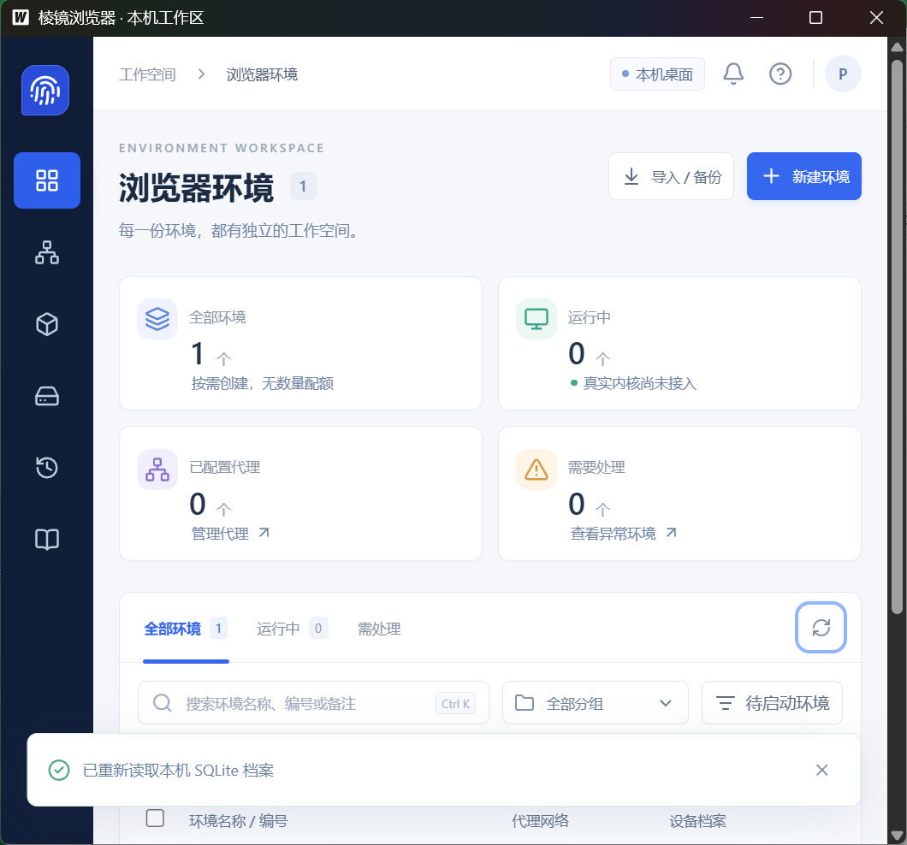

# T02 · Windows 桌面与本地持久化

Issue：[#3](https://github.com/axgiroud312-byte/prism-local-browser/issues/3)。关联：ENV-002、FP-001、UX-001。

## 前置和验收清单

2026-09-30 14:53 Asia/Shanghai 已读完整 Issue 与最新原生依赖。#2 CLOSED、PR #23 合入 `6cd681b`，公开应用契约和 DemoAdapter 的本地/远程检查全部通过，成果可用。当前只有 T02 进行中，不提前开发安装包或真实内核。

- [x] 桌面经 native adapter 调本地服务；SQLite 保存环境、显式固定 seed、必要引用；内核未安装准确为未就绪，不伪报启动能力。
- [x] 初始化/迁移可重复；外键、expectedRevision 保护；事务/磁盘失败不发布保存成功。
- [x] native 与原型 localStorage 隔离；拒绝把原型 JSON 当生产记录/凭据。
- [x] Windows 实际桌面创建/编辑→关闭应用→重开，ID/seed/名称/分组/偏好一致，无云登录或配额。
- [x] 服务公开契约测试、Windows 构建、实际桌面证据、回归、评审、文档、推送和远程检查完成。

## 现场与工具

- 基线 `6cd681b`（T01 已验收代码），Node 24.14.0；T01 41 测试/10 UI 已通过，无未解决失败。
- Windows WebView2 Runtime 154.0.4258.37 已安装；官方 Wails 文档显示 v2.15.0，Go module 发布元数据已核实更新的稳定 v2.16.0（2026-09-14），固定模块与 CLI 同一版本；modernc SQLite 固定 v1.60.1（2026-09-29）。
- 官方 Go 发布元数据：go1.27.1 / windows-amd64 / ZIP；实际下载后计算 SHA-256 **一致**：`a3911b5e0e1b1053f25ed0675f4c1c6aad1e2bfcf253df2b9be4caabd2edd95d`。工具 `.tools/go/`（忽略）；`go version` 实际为 `go1.27.1 windows/amd64`，不改系统 PATH。

## 验证结果

已验收；Windows 实际应用的进程、SQLite、页面操作和重开证据分别记录，不用 Playwright 原型检查替代。

- 2026-09-30 15:10：中断恢复核对实际 Git、Issue、依赖和工具；初始服务代码已存在但未编译/测试。没有已验收的桌面进度，不重新下载已核验工具。
- 15:20–15:50：CLI/doctor/模块下载成功。初轮10条 Go 契约通过，首个 Windows production exe 成功构建；增加真实 SQLite query_only 故障、连接替换外键、种子/损坏配置和 schema 保护后13条 Go 测试/vet 通过。49 JS 测试通过。测试类型检查中的 compatibility 属性引用已修复，完整回归运行中。
- 本轮真实 SQLite `SQLITE_FULL` 是通过 `max_page_count` 限制实际数据库页数产生，不是伪造错误返回；写失败后环境/档案/任务/幂等结果/成功活动均不出现部分记录。query_only 写失败允许同一 requestId/预览重试。
- 主代理唯一写入；只读子代理评审完成，未发现可确认阻断。评审明确桌面证据当时未完成，之后由主代理实测通过，不能用评审代替实机操作。

## 排错与真实桌面结果

- 15:50 首轮完整回归的第一条 UI 在冷启动总时限内超时；追踪显示创建/编辑/刷新及全部语义断言已执行，尚未完成末尾截图。保持原有断言和时限不变，单条重跑 11.7 秒通过，完整 11 条 UI 随后 29.8 秒全部通过；最终全检查还需复跑。
- 初版桌面验证尝试用环境变量开启 WebView2 调试，连接失败。根因是已固定 go-webview2 loader 主动清除外部调试覆盖；没有修改或绕过该安全行为，改用 Windows UI Automation 操作 **production exe**，不开放调试端口。旧脚本被替换，失败没有被统计为真实重开成功。
- UI Automation 的 datalist 输入映射为 ComboBox、表格状态为 DataItem，与网页选择器不同。首次两次脚本因此等待失败，已按实际可访问性树定位控件；没有改变产品数据或降低断言。许可导出中的 PowerShell 旧编码导致中文目录无法解析，已在项目脚本中固定 UTF-8；26 个实际 Go 运行时模块和 Go 标准库的通知生成通过。
- **2026-09-30 16:12–16:13，真实 Windows 验证通过**：从空合成数据库开启 exe → 创建“桌面合成环境” → 编辑为“桌面重开验证”，修改分组、备注、1440×900、启动网址及恢复标签页偏好 → 点击启动得到准确阻断 → WM_CLOSE 正常关闭 → 再次开启 exe → UI 和实际 SQLite 核对同一 ID/seed/名称/分组/全部偏好 → 打开指纹页再次核对 seed → 刷新与窄窗口操作可达 → 第二次正常关闭，数据库仍相同。两次正常退出均由测试自己启动的 PID 记录，不停止其他进程。
- 实际数据库 `user_version=1`、revision=2、显式 seed 与 UI 一致，`foreign_key_check` 无违规；环境仍绑定 `kernel-pending`，数据库状态 missing。没有真实代理凭据、Cookie 或 Chromium 用户目录。
- 16:33 额外打开真实 exe 的坏数据库场景：以合成 `prism-prototype` 文本写入专用 app.db，UI 显示“本地数据库无法打开，原数据未重置”，不出现“重置演示工作区”或内置示例。正常关窗后原文完全保留，见 [坏库实机脱敏记录](T02-corrupt-desktop.json)；这不是把原型格式当作 SQLite 导入。

可重复入口：[Windows UI 脚本](../../scripts/verify-desktop-ui.ps1)、[只读数据库核对](../../scripts/verify-desktop-db.mjs)、[runner](../../scripts/verify-desktop.mjs)。脱敏证据 [T02-desktop.json](T02-desktop.json) 包含测试 PID/正常退出、合成数据库投影、验收时间和实际 exe SHA-256；私人数据根不公开。16:20–16:27 最终 `npm run check`（49 JS / 类型 / 原型构建 / 25文档 / 11UI）、`test:desktop`（13Go/vet）、`build:windows`（production及26模块通知）、最新 exe `verify:desktop` 再次全部通过，截图/JSON已更新为这次实际产物。gofmt、diff check 通过。

## 剩余边界

- 本票为本地配置底座，不是产品安装包。`Get-AuthenticodeSignature` 实际状态 NotSigned，未签名；T03 实现安装/升级/卸载及 WebView2 先决条件。
- 内核安装、完整生成器与档案历史、真实启停/浏览数据/代理/Cookie/恢复及持久批量任务分别留给对应票；初始固定模板字段不能当成实际内核读值。
- 成功 requestId 与已完成 Operation 持久保存；预览只属当前服务会话。重开无已受理长任务继续执行，不假报 T13 完成。
- 代码提交 `134dc66` 已推送，[PR #24](https://github.com/axgiroud312-byte/prism-local-browser/pull/24) 的 [run 36689998979](https://github.com/axgiroud312-byte/prism-local-browser/actions/runs/36689998979) 全部通过：Windows Node 22.12.0 / 24 完整 `npm run check`；Windows Go 1.27.1 / 固定 Wails CLI 安装、13 Go/vet、production 构建与许可生成。CI 是服务/构建回归，不冒充 UIA 实机操作；实机证据在上述独立记录。
- 第二轮只读复核已完成且无确认阻断：独立核对 production exe 的实际 SHA-256、SQLite 全字段与公开截图；二十六个实际 Go 依赖模块、标准库与子组件许可齐全；UIA 清理限定自身 PID，CI 证据表述准确。复核未重跑构建或 UIA，没有把它们算作新增实测。
- 16:44–16:46：最终记录 `fc4aa47` 的 [run 36691104701](https://github.com/axgiroud312-byte/prism-local-browser/actions/runs/36691104701) Windows Node 22.12/24 与 desktop 三项均通过，已核对实际 headSha。PR #24 合入 `44517c5`，#3 四项验收勾选并 CLOSED，完成评论已同步。T02 完成，Goal 为 2/21；自动转入 T03，不将后续能力提前标记完成。
